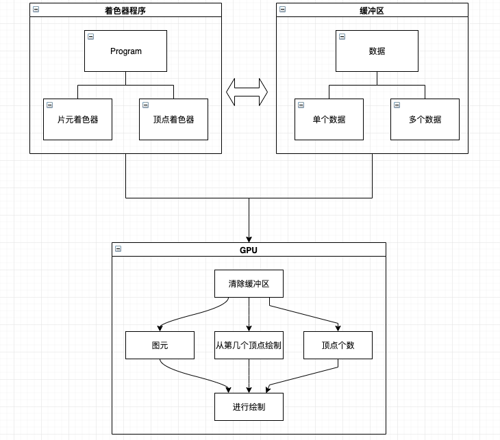
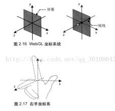

# WebGL基础



## 1. 获取WebGL上下文

其实就是创建`WebGLRenderingContext`对象，和`canvas2D`类似，直接通过`getContext`来获取WebGL上下文

```Javascript
const gl = canvas.getContext('webgl', options);
```

这里的`options`就是`WebGLContextAttributes`类型，包含下面几个属性

1. depth 创建深度缓冲区，默认值为true
2. stencil 创建模板缓冲区，默认值为false
3. alpha 设置颜色缓冲区的格式，true表示格式为rgba，false则为rgb，默认值为false
4. premultipiedAlpha 不使用预乘alpha，默认为true，暂时不会用到这个值
5. antialias 设置抗锯齿，硬件支持的话就会使用抗锯齿功能，默认为true
6. preserveDrawingBuffer 保留上一帧的渲染，默认值为false，即不保留

这里的选项一般不会用到，后面会在某些特殊场景下用到它来解决一些问题。

## 2. 初始化着色器

着色器简单来说就是给GPU执行的程序，使用GLSL语言编写，这种语言是一种类C的的强类型语言。

着色器包含两类

1. 顶点着色器
2. 片元着色器

顶点着色器控制点的位置和大小，片元着色器控制点的颜色。我们可以通过WebGL的API来向着色器中传递四种类型的数据：

1. attribute 一般用来存储顶点坐标数据
2. uniform 全局变量
3. texture 存储图像数据
4. varying 从顶点着色器给片元着色器传值的方式

在GLSL中还包括一些常用的内置的变量，目前用到的有下面几种：

1. gl_Position 顶点着色器中使用，表示图形的坐标
2. gl_PointSize 顶点着色器中使用，表示图形的大小
3. gl_FragColor 片元着色器中使用，表示要渲染的颜色

来看一个简单的着色器GLSL的代码就能明白了：

```c
// 顶点着色器
attribute vec4 a_Position;

void main() {
    gl_Position = a_Position;
    gl_PointSize = 10.0;
}

// 片元着色器
// 这里必须要定义数据精度
precision mediump float;

void main() {
    gl_FragColor = vec4(0.0, 0.0, 0.0, 1.0);
}
```

光有着色器还不能进行绘图，因为GPU并不认识着色器，所以我们需要将着色器组织起来，形成一个着色程序来交给GPU执行，这里就涉及到了两个类`WebGLShader`类和`WebGLProgram`类。

WebGLShader就是我们说的着色器，来看看如何创建WebGLShader：

### 创建shader对象

```JavaScript
const shader = gl.createShader(type);
/**
 *  type的类型可以下面两种
 *  1. gl.VERTEX_SHADER 顶点着色器类型
 *  2. gl.FRAGMENT_SHADER 片元着色器类型
 */
```

这里type就是上面说到的两类着色器，顶点和片元着色器。它们包含在WebGLRenderingContext的属性中，实际打印出来会发现就是number类型。

### 载入shader的源码

这里的源码就是一段GLSL编写的字符串，后面会详细去解释这个语言，现在只需要知道他是一个类C的语言，如下所示的代码片段就是着色器的GLSL的代码：

```c
// 顶点着色器
// 声明了一个变量，这个变量需要从外部传入进来
attribute vec4 a_Position;

void main() {
    // gl_Position是glsl内置的变量，表示所画对象的位置坐标信息
    gl_Position = a_Position;
}
```

```c
void main() {
    // gl_FragColor是一个内置变量，表示对象的像素信息
    // 这里vec4表示一个颜色的向量，每个分量分别表示rgba四个值，颜色范围取值在[0.0, 1.0]之间
    gl_FragColor = vec4(1.0, 0.0, 0.0, 1.0);
}
```

那就来执行载入源码：

```JavaScript
gl.shaderSource(shader, source);
```

### 编译源码

熟悉C语言应该都比较了解，运行代码时需要先进行编译操作，这里也是将载入着色器中的代码进行编译

```JavaScript
gl.compileShader(shader);
```

编译完成以后，可以去判断是否编译成功了：

```JavaScript
// 返回一个布尔值，成功的话为true，否则为false
const isSuccess = gl.getShaderParameter(shader, gl.COMPILE_STATUS);
```

### 将编译好的shader放入程序中

其实就是将编译好的顶点着色器和片元着色器组装起来，放入一个程序中，称之为**着色程序**

## 将数据放入缓冲区

上文提到的获取的数据就是从这里定义，并被传入着色器中的。我们通过缓冲区来向着色器中写入数据。

### 创建缓冲区

```JavaScript
// 创建缓冲区
const buffer = gl.createBuffer();
// 绑定缓冲区
gl.bindBuffer(gl.ARRAY_BUFFER, buffer);
```

### 创建数据，将数据写入缓冲区

这里的数据就是创建类型化数组，里面存储着色器需要的坐标数据或者是颜色数据信息。而之所以使用类型化数组，则是为了提高使用效率，因为在JS中的数组可以存储不同类型的值，内部为此做了很多取舍，所以效率实际上是比较低的，因此这里使用类型化数组作为数据载体。

```JavaScript
const data = new Float32Array([0.5, 0.5]);

gl.bufferData(gl.ARRAY_BUFFER, data, gl.STATIC_DRAW);
```

传递给类型化数组的参数就是普通的数组，里面的值就是要画的图形的一个坐标。这里简单介绍下WebGL的坐标系。

WebGL的坐标和canvas2D的坐标系都是直角坐标系，区别就在于原点不同，canvas2D的坐标系是以画布的左上角为坐标原点，而WebGL则是画布中心为坐标原点，并且坐标取值范围是在`[-1, 1]`之间，所以上述代码中的`[0.5, 0.5]`就是指的右上角的区域一半的位置。



后面也会涉及到很多坐标转换的计算，这里先不去深入，只要知道WebGL的坐标原点位置即可。

### 从缓冲区中取出数据赋给着色器中的变量

```JavaScript
// 获取着色器中的变量的引用
const a_Position = gl.getAttribLocation(program, 'a_Position');
// 将缓冲区中的数据赋给着色器变量
gl.vertexAttribPointer(a_Position, 2, gl.FLOAT, false, 0, 0);
// 启用此变量
gl.enableVertexAttribAarry(a_Position);
```

这里是将多个顶点数据一起赋值给着色器中的变量，如果只有一个顶点数据，也可以使用如下方法：

```JavaScript
// 这里是一系列的类似方法
// gl.vertexAttrib[1234]f，数字表示分量的个数
gl.vertexAttrib4f(a_Position, 1.0, 1.0, 0.0, 1.0);
```

## 绘制

终于到了绘制到canvas上这一步，首先需要清除canvas画布的缓冲区，WebGL的缓冲区，包括三种缓冲区：

1. 颜色缓冲区
2. 深度缓冲区
3. 模板缓冲区

```JavaScript
gl.clear(buffer);

/*
 * buffer参数可以选择下面三种之一
 * gl.COLOR_BUFFER_BIT 颜色缓冲区
 * gl.DEPTH_BUFFER_BIT 深度缓冲区
 * gl.STENCIL_BUFFER_BIT 模板缓冲区
 */
```

清空缓冲区以后就可以进行绘制了

```JavaScript
/**
 * 第一个参数 表示绘制的图元，WebGL的图元总共就三大类，点、线、三角形
 * 第二个参数 表示从第几个顶点开始绘制
 * 第三个参数 表示绘制多少个顶点数据 
 */
gl.drawArrays(gl.POINTS, 0, 1);
```

上面图元有以下几类，总结起来就是点、线、三角形这三类，不过细分的话，总共有下面几个值可以使用：

1. gl.POINTS
2. gl.LINES
3. gl.LINE_STRIP
4. gl.LINE_LOOP
5. gl.TRIANGLES
6. gl.TRIANGLE_STRIP
7. gl.TRIANGLE_FAN

所谓光栅化，就是用像素画出来的意思
