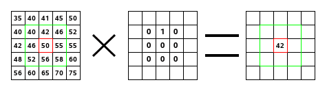

# 卷积矩阵（翻译）

[原文地址](https://docs.gimp.org/2.6/en/plug-in-convmatrix.html)

## 概述

这是数学家的领域。大多数过滤器都使用卷积矩阵。使用卷积矩阵滤镜，如果您愿意的话，您可以构建自定义滤镜。

什么是卷积矩阵？如果不使用只有少数人知道的数学工具，可能会对此有个大概的了解。卷积是另一种对矩阵的处理，称为“核”。

卷积矩阵滤镜使用第一个矩阵作为要处理的图像。图像是直角坐标中像素的二维集合。使用的内核取决于所需的效果。

GIMP（一种位图图像编辑器）使用5x5或3x3矩阵。我们将只考虑3x3矩阵，它们是最常用的矩阵，足以满足您想要的所有效果。如果内核的所有边界值都设置为零，则系统会将其视为3x3矩阵。

滤镜连续研究图像的每个像素。 对于每个像素，我们将其称为“初始像素”，它将该像素的值和周围8个像素的值乘以内核对应的值。 然后将结果相加，并将初始像素设置为此最终结果值。

一个简单的例子：

图像矩阵在左侧：每个像素都标有其值。初始像素具有红色边框。内核操作区域具有绿色边框。中间是内核，右边是卷积结果。

这就是发生的情况：滤镜从左到右，从上到下依次读取内核操作区域的所有像素。 它将每个值乘以内核对应值并相加结果。 初始像素已变为42：（40 * 0）+（42 * 1）+（46 * 0）+（46 * 0）+（50 * 0）+（55 * 0）+（52 * 0）+（ 56 * 0）+（58 * 0）=42。（滤镜对图像无效，但对副本无效）。 作为图形结果，初始像素向下移动了一个像素。
