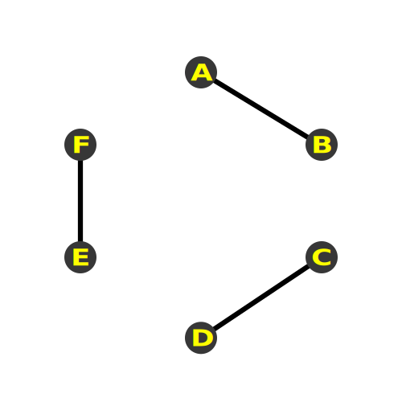

## 绘制三角形

### 如何传递缓冲数据

1. 创建缓冲区对象
2. 绑定缓冲区对象
3. 将数据写入缓冲区对象
4. 将缓冲区对象分配给一个attribute变量
5. 开启attribute变量

### 创建缓冲区

```js
gl.createBuffer();
```

### 绑定缓冲区对象

```js
gl.bindBuffer(target, buffer);
```
target可以是以下两个中的一个
- gl.ARRAY_BUFFER 表示缓冲区中的对象包含顶点数据
- gl.ELEMENT_ARRAY_BUFFER 表示缓冲区对象包含了顶点的索引值

### 向缓冲区对象写入数据

```gl
gl.bufferData(target, data, usage);
```

target就是上面所说的两种，data即是要绑定的数据，而usage表示程序如何使用存储在缓冲区对象中的数据，可以帮助WebGL优化操作，可以是下面几种类型之一：

- gl.STATIC_DRAW 表示只会向缓冲区对象中写入一次数据，但需要绘制多次
- gl.STREAM_DRAW 表示只会向缓冲区对象中写入一次数据，然后绘制若干次
- gl.DYNAMIC_DRAW 表示会向缓冲区对象中多次写入数据，并绘制很多次

### 类型化数组

简单来说就是数组中元素类型都相同的数组，提升了使用的性能。

[mdn参考链接](https://developer.mozilla.org/zh-CN/docs/Web/JavaScript/Typed_arrays)

类型化数组和普通数组的方法是不一样的，常用的方法可以看下表

方法属性或常量|描述|
|-|-|
|set(array, offset)|从第offset个元素开始，将arrary的值填充进去|
|length|数组的长度|
|BYTES_PER_ELEMENT|数组中每个元素所占的字节数|
|byteLength|数组中每个元素所占的字节数|总共使用的字节数

### 将缓冲区对象分配给attribute

```js
gl.vertexAttribPointer(index, size, type, normalized, stride, offset);
```

- index就是attribute变量的地址
- size就是缓冲区每个顶点分量个数，一般是1到4个
- type数据类型
  - gl.FLOAT 浮点型 FLoat32Array
  - gl.SHORT 短整型 Int16Array
  - gl.INT 整型 Int32Array
  - gl.UNSIGNED_BYTE 无符号字节型 Uint8Array
  - gl.UNSIGNED_INT 无符号整型 Uint32Array
  - gl.UNSIGNED_SHORT 无符号短整型  Uint16Array
- normalized 是否归一化，将数据归一到[0,1]或者[-1,1]区间内
- stride 相邻两个顶点的字节数，默认为0
- offset 指定缓冲区对象的偏移量

### 开启attribute变量

```js
gl.enableVertexAttribArray(index);
```

### 绘制图元

```js
/**
 * 第一个参数 表示绘制的图元，WebGL的图元总共就三大类，点、线、三角形
 * 第二个参数 表示从第几个顶点开始绘制
 * 第三个参数 表示绘制多少个顶点数据 
 */
gl.drawArrays(mode, count, offset);
```

1. gl.POINTS
2. gl.LINES



3. gl.LINE_STRIP


4. gl.LINE_LOOP


5. gl.TRIANGLES


6. gl.TRIANGLE_STRIP


7. gl.TRIANGLE_FAN


[图片来源](https://webglfundamentals.org/webgl/lessons/zh_cn/webgl-points-lines-triangles.html)

## 平移、旋转和缩放

### 仿射变换

> 仿射变换就是线性变换+平移

考虑如何在二维空间中平移一个点。

假设存在某个点A的坐标为x,y，把它向右平移3个单位，那么可以得到平移后的坐标：

```js
x1 = x + 3;
```

那么很容易得到这么一个方程，假设点的坐标为x,y，沿x轴平移Tx单位，沿y轴平移Ty单位：

```js
x1 = x + Tx;
y1 = y + Ty;
```

根据这个方程，就能知道如何平移一个图形。

再来看旋转


假设 B 点旋转了θ度到 C 点，B 点与 X 轴的角度是α度，计算 C 点的坐标。

利用正弦和余弦可以轻松得到以下的公式

```js
C.x = v * cos(α+θ);
C.y = v * sin(α+θ);
// 利用两角和公式
C.x = v * cosαcosθ - v * sinαsinθ;
C.y = v * cosαsinθ + v * cosθsinα;
// 再来看B点的坐标，容易知道
B.x = v * cosα;
B.y = v * sinα;
// 结合上面两式可知
C.x = B.x * cosθ - B.y * sinθ;
C.y = B.y * sinθ + B.x * cosθ;
```

这就解释了在 glsl 代码中所写

```glsl
vec2 pos = vec2(
  a_Position.y * u_Rotation.y - a_Position.x * u_Rotation.x,
  a_Position.x * u_Rotation.y + a_Position.y * u_Rotation.x
);
```

## 使用矩阵进行变换

## 课后思考

如何绘制正四边形、正五边形和正六边形
