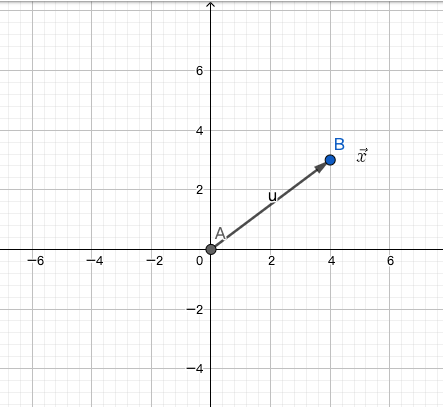
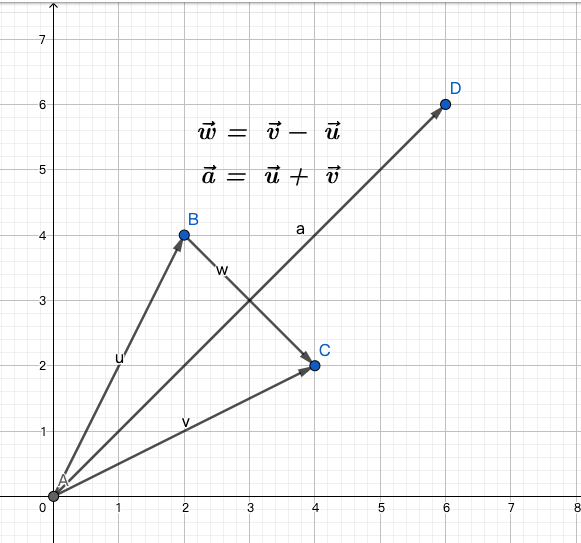
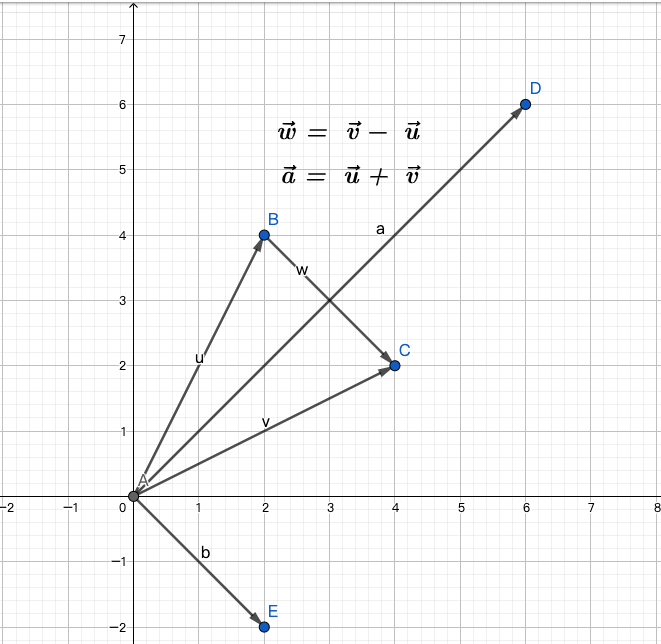
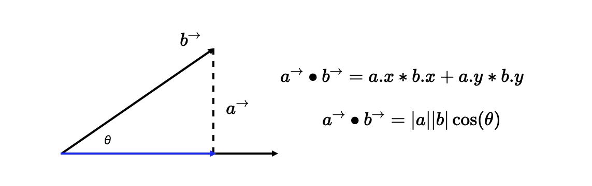
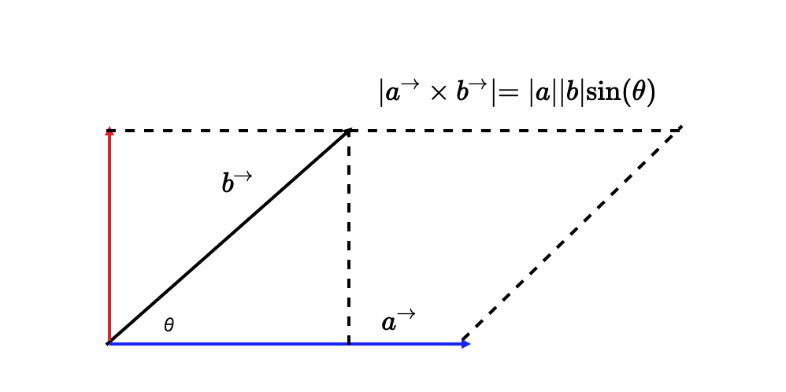
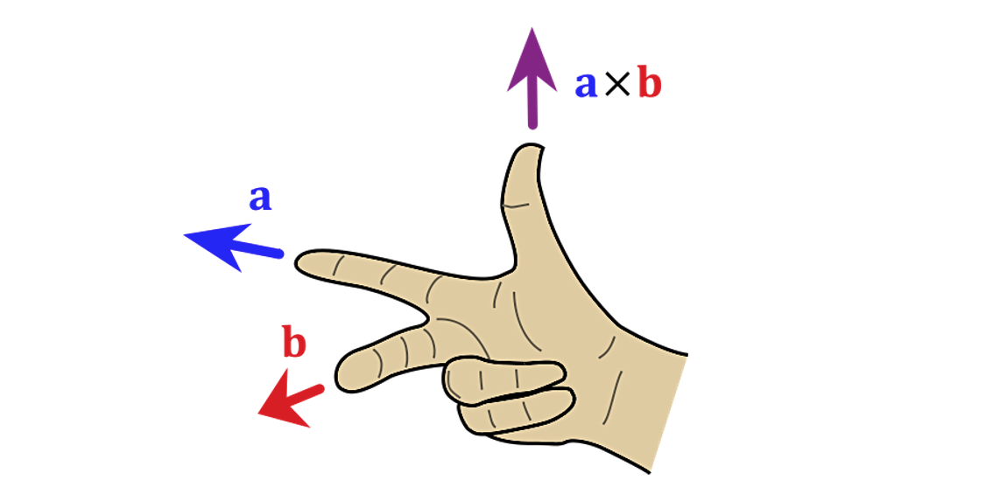

# WebGL数学篇

## 向量

带方向的线段就是**向量**，因此向量包含两个意思，一个就是要有一个方向，另外就是有一个长度。根据这个概念又可以引申出**标量**的概念，所谓标量就是没有方向的线段。

在数学上向量是这么表示的：



使用一个字母，在上面加上一个箭头就表示一个向量。向量的长度则可以使用‘||’双竖线表示，一些教材上也会使用两个双竖线来表示向量的长度，这里为了便于理解，统一都使用一个双竖线表示。

### 单位向量

单位向量是一种特殊的向量，表示长度为1的向量，通常只表示方向，后面说道向量归一化，实际就是将向量归一化为单位向量。

单位向量一般用一个`^`表示，读作`hat`，帽子的意思，例如单位向量a可以读作`a hat`。

在图形学中，用的比较多的就是向量的点乘和叉乘两个运算。其实向量也有加减法，一般我们都是说加法，减法就是取反方向的向量相加，所以是一样的运算。

### 向量加法



向量加法一般使用平行四边形法则来解决，当然也可以使用三角形法则来做。从上图中就能很容易看到最长的那个`向量a`就是`向量v`和`向量u`相加的结果，并且也满足加法的交换律，但是减法就不一样了，减法得到的结果是`向量w`，可能会有人疑惑，这个怎么组成平行四边形的呢？



这下能看出来相减的结果实际是第四象限的`向量b`，因为`向量w`和`向量b`长度相等，方向相同，因此这两个向量是相等的，所以为了便于计算，我们把`向量b`作为`向量v`减去`向量u`的结果。

如果用三角形法则的话，来看上图的`向量v`就是`向量u`和`向量w`的首尾相连组成的三角形最终得到的`向量v`。

然后我们来验证下向量加减是这么去计算的，按照图上的坐标，很容易就能得到下面的结果：

```sh
向量a = (向量v的x坐标 + 向量u的x坐标, 向量v的y坐标 + 向量u的y坐标)

向量w = (向量v的x坐标 - 向量u的x坐标, 向量v的y坐标 - 向量u的y坐标)
```

需要注意的是减法没有交换律的，如果交换两个操作数，那么得到的结果也是不一样的。

向量的加减说完了，下面就说下图形学中用的比较多的运算：点乘和叉乘。

### 向量的点乘

点乘运算一般都是这么表示：

```sh
向量b · 向量c
```
点乘的结果就叫做**点积**，点积是一个标量，为什么这么说呢，来看下点积是如何计算就明白了。

假如有两个向量，分别是向量a(x1, y1)，向量b(x2, y2)，那么他们的点积就是这么来计算的:



上图第一个式子很容易理解，就是两个向量的坐标相乘以后相加。而第二个式子也是在图形学中有非常重要的应用。其实根据上图也能容易看出`向量b`的长度乘以他们的夹角，实际就是这个直角三角形的底边。

我们再次带入值去验证一下，假设`向量b`的坐标为(2,2)，`向量a`的坐标为(5, 0)，他们之间的夹角为45度，那么分别应用两个公式就可知：

```sh
# 式一
向量a • 向量b = 2*5 + 2*0 = 10

# 式二
向量a • 向量b = 5 * bcos(45°) = 5 * 2√2 * (√2 / 2) = 10
```

所以向量的点乘的几何意义就是**a 向量乘以 b 向量在 a 向量上的投影分量**

有了上面的分析，那么就可以做出一些特殊情况的推导：

1. 如果向量夹角为0，也就是相互平行，那么余弦值就是1，其点积就是两个向量的长度相乘。

2. 如果向量夹角为90°，即相互垂直，余弦值为0，那么点积结果也就是0。

### 向量的叉乘

向量的叉乘一般这么表示：

```sh
向量a ✖️ 向量b
```

向量叉乘的结果叫做**叉积**，这和点积是一样的。需要注意点积是一个标量，但是叉积是还是一个向量。



如上所示，在二维空间中，向量的叉乘运算就是两个向量围成的平行四边形的面积，或者说是`向量a`与(`向量b`在`向量a`的垂直方向，也就是红色箭头线段上的投影)的乘积，也就是红色和蓝色箭头围成的矩形面积。(这段话比较绕，需要好好体会)。

这是叉乘在二维空间中的几何意义，推广到三维的话，叉积就是垂直于两个向量围成的平面。这么说不太好理解，来看下图片就明白：



这也是上篇提到的**右手定则**。其实我们也可以使用更加简单的**右手螺旋定则**来确定叉积的方向。例如上图中的`向量a`叉乘`向量b`，我们伸出大拇指，将剩下四个手指并排伸开，按照从a到b的方向旋转，这样大拇指所指的方向就是两个向量叉积的方向了。

接下来就说说如何计算叉积。上图已经显示了叉积计算的公式就是两个向量的长度相乘，再乘上他们夹角的正弦值。

```sh
a × b = [y1 * z2 - y2 * z1, - (x1 * z2 - x2 * z1), x1 * y2 - x2 * y1]
```

这里我们使用了三维向量来表示，如果是在二维空间中，那所有的z的值都为0，于是两个向量的叉乘就是：

```sh
a × b = x1 * y2 - x2 * y1
```

知道了向量的叉乘，那么就来看看向量叉乘的一些应用。例如求某个点到某个向量的距离。

根据上面所说，向量的叉乘的结果就是两个向量的平行四边形的面积，那么利用叉乘，立刻就能知道这个平行四边形的面积，然后再除以底边的向量，得到的就是另外一个向量到底部向量的垂直距离，也就是我们要求的结果。

### 向量的归一化

归一化就是将向量除以自己的长度，从而变成单位向量，如果向量都是单位向量的话，则上面得到的公式又可以简化：

```sh
# 点乘
a • b = |a||b|cos𝜽 = cos𝜽

# 叉乘
a × b = |a||b|sin𝜽 = sin𝜽
```

我们又能知道，如果两个向量都是单位向量，我们就能立刻得到这两个向量的正弦值和余弦值，根据这两个值就能得到两个向量的夹角。这点在后续的绘图中非常重要。

## 参数方程

## 矩阵

### 平移矩阵
### 缩放矩阵
### 旋转矩阵
