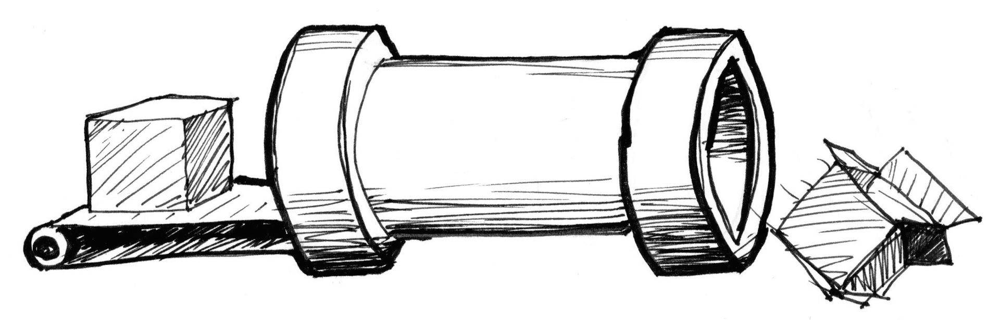
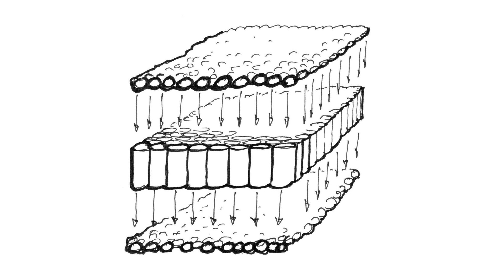
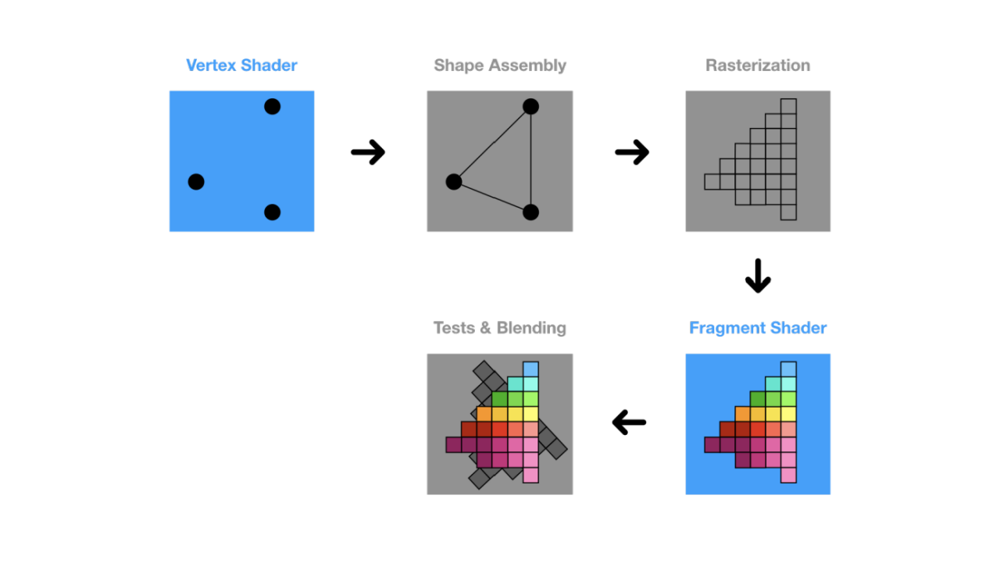

## 概念

- 顶点着色器
- 片元（片段）着色器
- GL着色语言
- 着色程序
- 类型化数组
- 属性和缓冲attributes
- 全局变量uniforms
- 纹理texture
- 可变量varying
- 裁剪空间和屏幕空间

## 工作原理

### 渲染管线（RenderPipelines）

> 一是对给定的数据结合绘图的场景要素（例如相机、光源、遮挡物体等等）进行计算，最终将图形变为屏幕空间的 2D 坐标。二是为屏幕空间的每个像素点进行着色，把最终完成的图形输出到显示设备上，这个过程叫做渲染管线。

### 光栅（Raster）

> 指构成图像的像素阵列，而**光栅化**就是用像素画出来的意思

### 像素（Pixel）

> 一个像素对应图像上的一个点，它通常保存图像上的某个具体位置的颜色等信息

### 帧缓存（Frame Buffer）

> 在绘图过程中，像素信息被存放于帧缓存中，帧缓存是一块内存地址

### CPU（Central Processing Unit）中央处理单元

上图就是一个CPU的管道，也就是俗称的线程

### GPU（Graphics Processing Unit）图形处理单元

GPU 是由大量的小型处理单元构成的，可以保证每个单元并行处理一个简单的任务

### WebGL如何工作的

1. 顶点着色器：首先通过顶点着色器，确定设置的顶点的位置。
2. 图元装配：根据设置的图元将其组装成对应的基本图形。
3. 光栅化：将上一步装配好的图形使用像素来表示。
4. 片元着色器：光栅化以后，每个像素都会执行片元着色器中的程序，得到最终的颜色值。
5. 测试与混合：这一阶段主要是 WebGL 内部进行了一些模版测试、深度测试，最后再与上一帧的数据进行混合。
